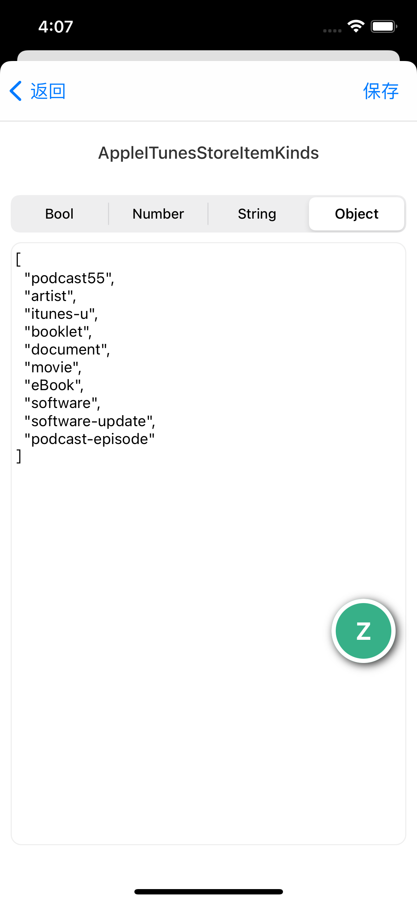
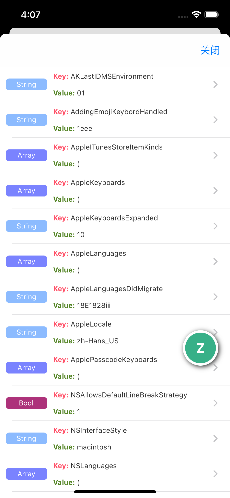

# DDUserDefaultManager

   

### [中文文档](https://ddceo.com/blog/1289.html)

iOS UserDefault data management, iOS UserDefault数据管理

## install

cocoapods

```ruby
pod 'DDUserDefaultManager'
```

### Use

```swift
DDUserDefaultManager.shared.start()
```

## Preview

|File List|File Type Icon|
|----|----|
|||

Function example


## License

The project is based on the MIT License
