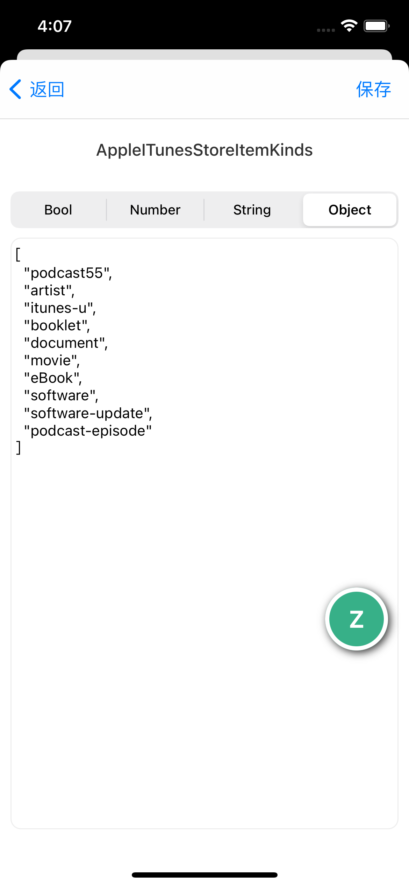

# ZXUserDefaultManager

iOS UserDefault data management, iOS UserDefault数据管理

该项目是[ZXKitSwift](https://github.com/ZXKitCode/ZXKitSwift)的内置功能插件，也可以单独集成当做独立功能使用。

**如果您已经集成了`ZXKitSwift`，插件列表中会自动显示该数据管理浏览器，不需要再重复集成。**


## 独立集成

cocoapods快速集成

```ruby
pod 'ZXUserDefaultManager'
```

### 使用

```swift
//显示管理器
ZXUserDefaultManager.shared.start()
```

## `ZXKit`个性化集成

**如果您已经集成了`ZXKitSwift`，插件列表中会自动显示该文件浏览器，不需要再重复集成。**

如果需要支持`ZXKit`，可以使用cocoapods快速集成

```ruby
pod 'ZXUserDefaultManager/zxkit'
```

之后可在`AppDelegate`的启动函数中注册到`ZXKit`即可

```swift
func application(_ application: UIApplication, didFinishLaunchingWithOptions launchOptions: [UIApplication.LaunchOptionsKey: Any]?) -> Bool {
	
	//ZXKit注册
	ZXKit.regist(plugin: ZXUserDefaultManager.shared)
	
	return true
}

```

## 预览


|文件列表|文件类型|
|----|----|
|||

功能示例


## License


Base on Apache-2.0 License
